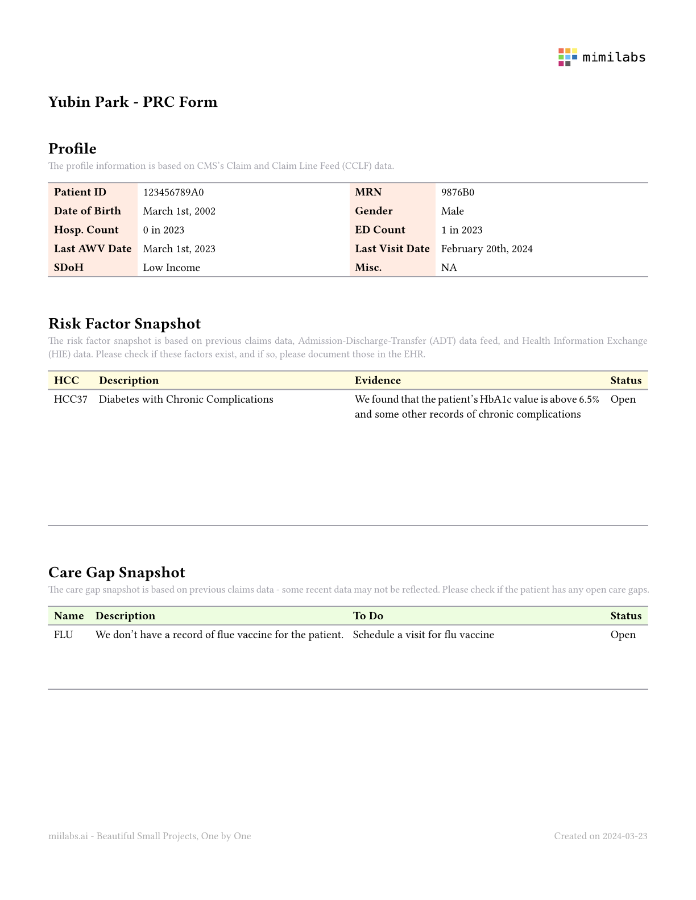

# `mimi-pdf-services`

A lightweight and fast PDF (+ PNG, SVG) generator.

For many years, I have been bothered by PDFs. Yes, we deal with many PDF files in healthcare, and often, we need to generate millions of PDF files. The problem is that we do not have a lightweight solution for the task.

That was the case until I came across [Typst](https://typst.app/home/). 
Typst is a typesetting system built in Rust that can generate PDF, PNG, and SVG documents blazingly fast. With Typst, I realized that I could finally reliably and swiftly generate PDF files, which I have always wanted. 

`mimi-pdf-services` is built using four separate technologies:

- [Typst](https://typst.app/home/): PDF compiler
- [FastAPI](https://fastapi.tiangolo.com/): API server
- [Auth0](https://auth0.com/): As the API server faces the internet, we want to protect the endpoints. We use Auth0 for that. 
- [Docker](https://www.docker.com/): We use Docker to containerize the whole service.

On top of these four technologies, 
I added a bit to make it more useable in the healthcare industry. 
For example, with `mimi-pdf-services`, you can generate a document like below by simply calling an API call:



To generate this form, it only takes a few milliseconds (+ a bit more with network latency). 


## Getting Started

There are two ways to get started with the mimi-pdf-services engine: 
easy full-service model and hard DIY model. 
First, we recommend the easy full-service model.
You just need to contact us for an API key, and that's it. 
You can start using the service.
If you chose this path, you can go to the next section on how to use the engine.
On the other hand, if you want more freedom, you can choose the hard way - using it from the source code. 
This section will illustrate how to do the latter.

### Setting up the Auth0 account

- https://auth0.com/blog/build-and-secure-fastapi-server-with-auth0/
- https://github.com/auth0-blog/auth0-python-fastapi-sample/tree/main

### Building the image

You can build a container image using the Dockerfile in this repository as below:

```bash
# build the image
docker build -t mimi-pdf-services .

# test running the image (optional)
docker run -it -p 8000:8000 mimi-pdf-services
```

### Running the image on AWS

You can run the container image however you want - run it locally or on different cloud providers. 
If you want to run it on AWS, you can follow the steps based on the [AWS ECS Tutorial](https://docs.aws.amazon.com/AmazonECS/latest/developerguide/create-container-image.html) as below:

```bash
# Create an Amazon ECR repository
aws ecr create-repository --repository-name mimi-pdf-services --region <region>

# Tag with the repository URI returned from the above command
docker tag mimi-pdf-services <aws_account_id>.dkr.ecr.<region>.amazonaws.com/mimi-pdf-services

# Authenticate
aws ecr get-login-password --region <region> | docker login --username AWS --password-stdin <aws_account_id>.dkr.ecr.<region>.amazonaws.com

# Upload the image
docker push <aws_account_id>.dkr.ecr.<region>.amazonaws.com/mimi-pdf-services
```


# License

[APACHE LICENSE, VERSION 2.0](https://www.apache.org/licenses/LICENSE-2.0)
