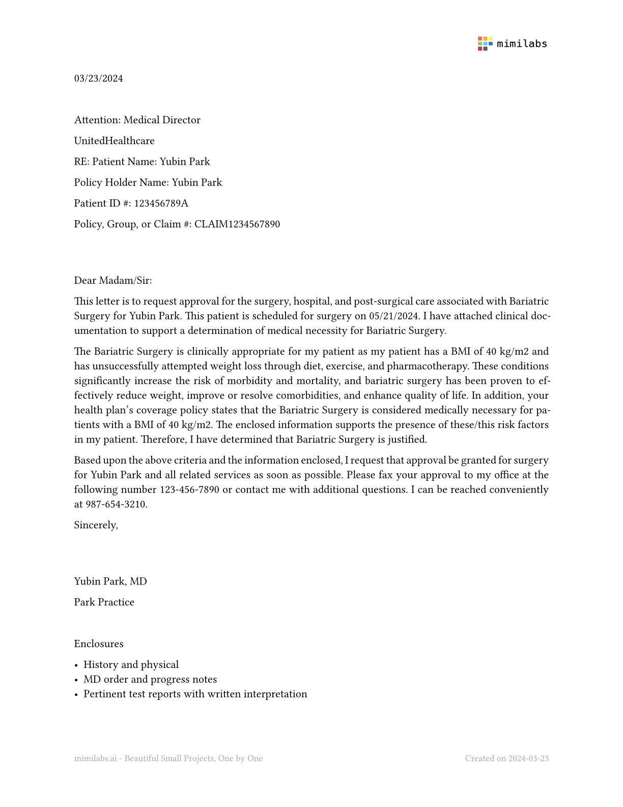
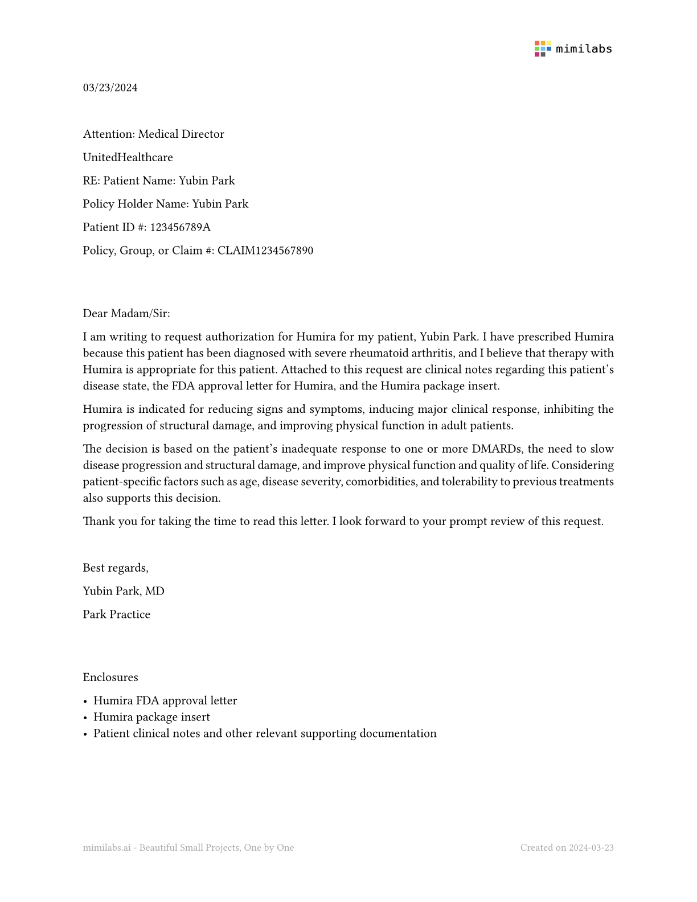
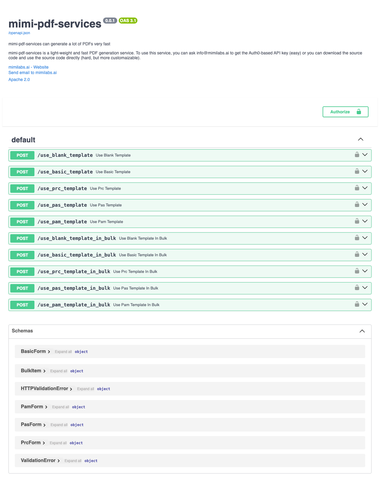

# `mimi-pdf-services`

A lightweight, **_super fast_**, and publishing-grade PDF (+ PNG, SVG) generator.

## How Fast?

With the bulk mode, it only takes 35 milliseconds to generate a PDF document on average. 

**_In other words, it takes 35 seconds, less than a minute, to generate 1,000 PDF documents._**


## Publishing-grade?

`mimi-pdf-services` generates publishing-grade, really good quality documents. You can also use some healthcare-specific templates to mass-produce these high-quality documents. For more details, please check out the [gallery](/gallery) folder.

Template Name | Sample Document | End-point | Use Cases 
:------------:|:---------------:|:---------:|:----------:
Blank | | `{URL}/use_blank_template` | Any use case 
Basic | | `{URL}/use_basic_template` | Free-form official letters
PRC | | `{URL}/use_prc_template` | PRC Form, e.g., wellness check
PAS | | `{URL}/use_pas_template` | Prior Authorization for surgeries
PAM | | `{URL}/use_pam_template` | Prior Authorization for medications


## Background/Why

For many years, I have been bothered by PDFs. Yes, we deal with many PDF files in healthcare, and often, we need to generate millions of PDF files. The problem is that we do not have a lightweight solution for the task.

That was the case until I came across [Typst](https://typst.app/home/). 
Typst is a typesetting system built in [Rust](https://www.rust-lang.org/) that can generate PDF, PNG, and SVG documents blazingly fast. With Typst, I realized that I could finally reliably and swiftly generate PDF files, which I have always wanted. 

`mimi-pdf-services` is built on four separate technologies:

- [Typst](https://typst.app/home/): PDF/PNG/SVG compiler
- [FastAPI](https://fastapi.tiangolo.com/): API server
- [Auth0](https://auth0.com/): As the API server faces the internet, we want to protect the endpoints. We use Auth0 for that. 
- [Docker](https://www.docker.com/): We use Docker to containerize the whole service.

On top of these four technologies, 
I added a bit of spices to make it more immediately useable/useful in the healthcare industry. 

It is lightweight and easy to use. To learn more, please check out the API documentations at [https://pdfservices.mimilabs.org/docs](https://pdfservices.mimilabs.org/docs).



## Getting Started

There are two ways to get started with the mimi-pdf-services engine: 
**easy full-service way** and **hard DIY way**.

First, we recommend the easy full-service model.
You just need to contact us for an API key, and that's it. 
You can start using the service immediately.
We will manage all the hairy details and groundwork for you. 
If you chose this path, you can go to the next section on how to use the engine.

However, if you want more freedom, you can choose the latter path - using it from the source code. 
This section will illustrate how to do the latter.

### Setting up the Auth0 account

The API server faces the internet, and you want to prevent any random folk using the service.
For that, we use Auth0 as an authentication authority. 
If you are not signed up for Auth0, you would need to sign up. 
Once you signed up, you would need to create a new API application to fill out these environment variables:

```bash
AUTH0_DOMAIN = 
AUTH0_API_AUDIENCE = 
AUTH0_ISSUER = 
AUTH0_ALGORITHMS = RS256
AUTH0_CLIENT_ID = 
AUTH0_CLIENT_SECRET = 
```

After you fill out the values, save this information in `.env` on the root path of the project folder.

For more details, please see these blog posts from Auth0:

- https://auth0.com/blog/build-and-secure-fastapi-server-with-auth0/
- https://github.com/auth0-blog/auth0-python-fastapi-sample/tree/main

### Building the image

Once you are done with Auth0, you can now build a container image using the [Dockerfile](Dockerfile) in this repository as below:

```bash
# build the image
docker build -t mimi-pdf-services .

# test running the image (optional)
docker run -it -p 8000:8000 mimi-pdf-services
```

### Running the image on AWS

You can run the container image however you want - run it locally or on different cloud providers. 
If you want to run it on AWS, you can follow the steps based on the [AWS ECS Tutorial](https://docs.aws.amazon.com/AmazonECS/latest/developerguide/create-container-image.html) as below:

```bash
# Create an Amazon ECR repository
aws ecr create-repository --repository-name mimi-pdf-services --region <region>

# Tag with the repository URI returned from the above command
docker tag mimi-pdf-services <aws_account_id>.dkr.ecr.<region>.amazonaws.com/mimi-pdf-services

# Authenticate
aws ecr get-login-password --region <region> | docker login --username AWS --password-stdin <aws_account_id>.dkr.ecr.<region>.amazonaws.com

# Upload the image
docker push <aws_account_id>.dkr.ecr.<region>.amazonaws.com/mimi-pdf-services
```

### The Rest

Once the image is uploaded to AWS, you can use the image however you want. 
For example, you can use the AWS Fargate to create an auto-scalable service, which we did for `pdfservices.mimilabs.org`.

Good luck!


# License

[APACHE LICENSE, VERSION 2.0](https://www.apache.org/licenses/LICENSE-2.0)
